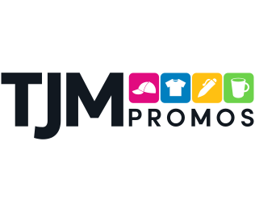
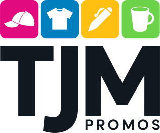
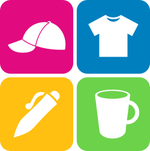
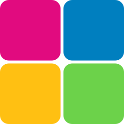

# Brand Identity Guide - TJM Promos

**Version:** 1.0
**Last Updated:** 11-20-2025
**Owner:** Kristen McKenney | Marketing

---

## Table of Contents

1. [Introduction](#introduction)
2. [Brand Story & Values](#brand-story--values)
3. [Visual Identity](#visual-identity)
4. [Voice & Messaging](#voice--messaging)
5. [Quick Reference](#quick-reference)

---

## Introduction

### Purpose of This Guide

This brand identity guide serves as the definitive resource for maintaining consistency across all brand touchpoints. It ensures that everyone—from internal teams to external partners—represents our brand accurately and cohesively.

### Who Should Use This Guide

- Marketing and communications teams
- Design and creative teams
- External agencies and vendors
- Product teams
- Sales and customer success teams

### How to Use This Guide

Refer to this guide whenever creating brand materials, communications, or customer-facing content. When in doubt, consult the relevant section or contact Kristen McKenney at <k.mckenney@tjmpromos.com>.

---

## Brand Story & Values

### Brand Overview

**Brand Name:** TJM Promos

**Tagline:** Your logo. Our products. Unlimited possibilities.

**Industry:** Custom Promotional Products

**Founded:** 2006

### Mission Statement

> [Your mission statement goes here. Describe what your organization does and why it exists. Example: "We empower creators to build authentic connections with their audiences through innovative storytelling tools."]

### Vision Statement

> [Your vision statement goes here. Describe where you want to be in the future. Example: "To be the world's most trusted platform for creative expression and community building."]

### Core Values

1. **[Value Name]**
   [Brief description of what this value means and how it manifests in your work]

2. **[Value Name]**
   [Brief description of what this value means and how it manifests in your work]

3. **[Value Name]**
   [Brief description of what this value means and how it manifests in your work]

4. **[Value Name]**
   [Brief description of what this value means and how it manifests in your work]

### Brand Personality

Our brand personality can be described as:

- **[Trait 1]:** [Explanation - e.g., "Approachable: We speak in a friendly, conversational tone"]
- **[Trait 2]:** [Explanation - e.g., "Innovative: We embrace new ideas and cutting-edge solutions"]
- **[Trait 3]:** [Explanation - e.g., "Trustworthy: We deliver on our promises and prioritize transparency"]
- **[Trait 4]:** [Explanation - e.g., "Bold: We're not afraid to challenge the status quo"]

### Brand Positioning

**Target Audience:** [Describe your primary audience - demographics, psychographics, pain points]

**What We Do:** [Concise description of your product/service offering]

**What Makes Us Different:** [Your unique value proposition and key differentiators]

**Brand Promise:** [The commitment you make to your customers]

---

## Visual Identity

**Logo System**

### Primary Logo

 

**Description:**  

The TJM Promos logo is a clean, modern wordmark accompanied by a row of colorful, icon-based tiles that visually represent the promotional products industry.

###### Wordmark 

- “TJM” appears in bold, black, sans-serif uppercase letters.
- “PROMOS” sits beneath the icon row, aligned right, in a smaller sans-serif typeface.
- The typography has a contemporary, geometric feel that conveys stability and professionalism.

###### Icon Strip

A series of four square tiles sits above the word PROMOS, to the right of “TJM.”
Each tile uses a bright, vibrant color and contains a simple white silhouette of a promotional product:

1. Magenta Tile (#EC008C) Icon: Baseball cap  
2. Cyan Tile (#007AFF) Icon: T-shirt  
3. Yellow Tile (#FFC107) Icon: Pen  
4. Green Tile (#4CD964) Icon: Mug or drinkware  

- *These icons reinforce the brand’s core product categories and add energy to the design.*

###### Visual Style

- Bold and clean with high contrast between the black wordmark and the colorful tiles.
- Flat design — no gradients, shadows, or textures.
- Iconography style: Simple silhouettes with rounded, friendly edges.
- Layout: Horizontal, left-anchored wordmark with right-aligned icon strip.

**Usage:** Use the primary logo in most applications where there's sufficient space and contrast.

**Minimum Size:**
- Print: 1 inch
- Digital: 100 pixels wide

**Clear Space:** Maintain clear space equal to the height of the logo on all sides.

**File Formats Available:**
- Vector: `.svg`
- Raster: `.png` (transparent)

___

### Logo Variations


#### Horizontal (Primary) Version

  

**Description:**

See Primary description above.

#### When to Use the Horizontal (Primary) Logo  

Use the horizontal logo when the layout benefits from a wide, low-profile format.

**✔ Website Headers & Navigation Bars**

- Areas with limited vertical space
- Provides better alignment with horizontal interface elements.

**✔ Email Signatures**

- Fits well next to text without disrupting line height.

**✔ Vehicle Graphics**

- Long, narrow spaces such as door panels or banners.

**✔ Branded Apparel**

- Left-chest embroidery or screen printing

- Horizontal orientation typically improves clarity at small sizes.

___


#### Vertical (Stacked) Version:


  

**Description:** 

The stacked version of the TJM Promos logo presents a vertically arranged composition designed for compact or centered layouts.

###### Icon Row ######

At the top of the logo is a horizontal row of four square product-category tiles, each containing a white silhouette icon:

1. Magenta Tile (#EC008C) Icon: Baseball cap
2. Cyan Tile (#007AFF) Icon: T-shirt
3. Yellow Tile (#FFC107) Icon: Pen
4. Green Tile (#4CD964) Icon: Mug or drinkware

*The tiles are rounded-corner squares with bold, flat color fills. The icons are simple, clean silhouettes aligned centrally within each tile.*

###### Wordmark ######

Below the icon row sits the stacked wordmark:

- “TJM” is displayed prominently in large, bold, black sans-serif lettering.
- “PROMOS” appears beneath it in smaller, spaced, uppercase sans-serif letters, also in black.
- The typography is geometric and modern, creating a professional and polished appearance.

###### Overall Style ######

- Vertical hierarchy with strong top-down visual flow.
- Clean, flat iconography with vibrant accent colors balanced by a bold, dark wordmark.
- Ideal for square, centered, or vertically constrained layouts.

#### When to Use the Vertical (Stacked) Logo

Use the stacked logo when the design space benefits from a tall, centered, or compact footprint, including:

**✔ Social Media Profiles**

- Square or near-square spaces (e.g., Instagram, Facebook, LinkedIn profile icons)
- The stacked format maintains readability even at smaller sizes.

**✔ Branded Merchandise**

- Items with a centered logo placement (e.g., notebooks, drinkware, patches)
- Surfaces where height is available but width is limited.

**✔ Print Materials**

- Flyers, posters, or banners that require a centered and prominent logo
- Layouts where a vertical orientation maintains balance and hierarchy.

**✔ Web & Digital**

- Mobile layouts with narrow horizontal space
- Website footers or areas where a block-style brandmark is preferred.

___


### Logomark/Icon/Symbol Only:

#### Logomark With Icons (Four Tiles + Product Icons)

  

**Description:**

This logomark consists of a 2×2 grid of vibrant square tiles, each with rounded corners and a bold, flat fill color. Each tile contains a simplified white silhouette representing a core promotional product category:

1. Magenta Tile (#EC008C) Icon: Baseball cap
2. Cyan Tile (#007AFF) Icon: T-shirt
3. Yellow Tile (#FFC107) Icon: Pen
4. Green Tile (#4CD964) Icon: Mug or drinkware

The color palette is bright, energetic, and instantly recognizable as TJM Promos. The white icon silhouettes are clean, centered, and evenly sized, creating a balanced and friendly visual presence.

**Character & Purpose**

- Highly recognizable and brand-distinctive
- Communicates “promotional products” at a glance
- Works at moderate to small sizes while retaining legibility

#### When to Use the Icon Logomark (Tiles + Icons)

Ideal when you want strong brand recognition and when icon detail will remain clear.

**Recommended Uses**

- Social Media Profile Images
  - Facebook, LinkedIn, Instagram, YouTube
  - Creates instant recognition and communicates industry visually

- App Icons
  - Mobile or desktop app symbols where detail is still readable

- Marketing Materials
  - Stickers, badges, internal graphics, or digital stamps

- Branded Merch
  - Embroidery, patches, packaging, etc., where moderate detail is acceptable

**Avoid When**

- The size will become too small for icons to remain legible
- Overly complex backgrounds disrupt the white silhouettes

___

#### Non-Icon Logomark (Color Tiles Only)

  

**Description:**

This version displays the same 2×2 grid of rounded-square tiles in TJM’s signature magenta, blue, yellow, and green—but without the white product icons. It is a purely abstract representation of the brand’s visual identity.

The simplified form increases scalability and versatility while maintaining strong brand association through color and layout.

**Character & Purpose**

- Minimal, modern, and clean
- Highest legibility at very small sizes
- Allows color to become the primary brand signal without requiring icon detail

#### When to Use the Non-Icon Logomark (Color Tiles Only)

This version excels in extremely small uses or minimal design applications where clarity is essential.


**Recommended Uses**

- Favicons / Browser Tabs
  - Best choice because icons may be too small to read at 16×16 or 32×32 pixels

- Mobile App Favicons / PWA Icons
- Watermarks or Background Graphics
  - Subtle and clean without distracting details
- Small UI Elements
  - Buttons, badges, or tight layouts

- High-contrast or busy backgrounds
  - Simplified shape maintains visibility

**Avoid When**

- The mark needs to communicate product categories or identity on its own
(Use the icon version for more expressive branding)

___

**Monochrome Versions:**

  
  
  

- Black on white
- White on black
- Single color applications

#### Logo Don'ts

❌ Do not rotate or distort the logo
❌ Do not change logo colors outside approved palette
❌ Do not add effects (shadows, gradients, outlines)
❌ Do not place on busy backgrounds without sufficient contrast
❌ Do not recreate or modify the logo

### Color Palette

#### Primary Colors

**[Primary Color Name]**
- **HEX:** #[XXXXXX]
- **RGB:** [R], [G], [B]
- **CMYK:** [C]%, [M]%, [Y]%, [K]%
- **Pantone:** [PMS XXXX]
- **Usage:** [Primary brand color for headers, CTA buttons, key elements]

**[Secondary Color Name]**
- **HEX:** #[XXXXXX]
- **RGB:** [R], [G], [B]
- **CMYK:** [C]%, [M]%, [Y]%, [K]%
- **Pantone:** [PMS XXXX]
- **Usage:** [Complementary color for accents and highlights]

#### Secondary/Accent Colors

**[Accent Color 1]**
- **HEX:** #[XXXXXX]
- **RGB:** [R], [G], [B]
- **Usage:** [Specific use cases]

**[Accent Color 2]**
- **HEX:** #[XXXXXX]
- **RGB:** [R], [G], [B]
- **Usage:** [Specific use cases]

#### Neutral Colors

**[Dark Neutral]**
- **HEX:** #[XXXXXX] (e.g., #1A1A1A)
- **Usage:** Body text, dark backgrounds

**[Medium Gray]**
- **HEX:** #[XXXXXX] (e.g., #666666)
- **Usage:** Secondary text, borders

**[Light Gray]**
- **HEX:** #[XXXXXX] (e.g., #F5F5F5)
- **Usage:** Backgrounds, subtle dividers

**White**
- **HEX:** #FFFFFF
- **Usage:** Backgrounds, reversed text

#### Color Usage Guidelines

**Backgrounds:**
- Primary backgrounds: [Color specifications]
- Alternate backgrounds: [Color specifications]

**Text on Backgrounds:**
- Ensure minimum contrast ratio of 4.5:1 for body text
- Ensure minimum contrast ratio of 3:1 for large text (18pt+)

**Call-to-Action Elements:**
- Primary CTA: [Color specification]
- Secondary CTA: [Color specification]

### Typography

#### Primary Typeface

**Font Family:** [Font Name]

**Weights Available:**
- Light (300)
- Regular (400)
- Medium (500)
- Bold (700)

**Usage:**
- Headlines and titles
- UI elements
- Marketing materials

**Web Font:**
```html
<!-- Google Fonts / Adobe Fonts / Custom CSS -->
@import url('[Font URL]');
```

**Fallback Stack:**
```css
font-family: '[Primary Font]', -apple-system, BlinkMacSystemFont, 'Segoe UI', sans-serif;
```

#### Secondary Typeface

**Font Family:** [Font Name]

**Weights Available:**
- Regular (400)
- Italic (400)
- Bold (700)

**Usage:**
- Body text
- Long-form content
- Subheadings

**Web Font:**
```html
@import url('[Font URL]');
```

#### Type Scale

**Headings:**

**H1 - Main Headline**
- Font: [Font Name]
- Size: [XX]pt / [X.X]rem
- Weight: [Weight]
- Line Height: [X.X]
- Letter Spacing: [X]%

**H2 - Section Headline**
- Font: [Font Name]
- Size: [XX]pt / [X.X]rem
- Weight: [Weight]
- Line Height: [X.X]

**H3 - Subsection Headline**
- Font: [Font Name]
- Size: [XX]pt / [X.X]rem
- Weight: [Weight]
- Line Height: [X.X]

**Body Text:**

**Body Large**
- Font: [Font Name]
- Size: [18]pt / [1.125]rem
- Weight: Regular (400)
- Line Height: [1.6]

**Body Regular**
- Font: [Font Name]
- Size: [16]pt / [1]rem
- Weight: Regular (400)
- Line Height: [1.5]

**Body Small**
- Font: [Font Name]
- Size: [14]pt / [0.875]rem
- Weight: Regular (400)
- Line Height: [1.4]

**Special Text Styles:**
- **Links:** [Color], underline on hover
- **Quotes:** [Styling specifications]
- **Captions:** [Font, size, style]

#### Typography Don'ts

❌ Do not use more than 2-3 font weights in a single design
❌ Do not use fonts outside the approved typeface families
❌ Do not set body text smaller than 14pt/0.875rem
❌ Do not use tight line-height (< 1.3) for body text
❌ Do not use all caps for long passages

### Imagery Style

#### Photography Guidelines

**Style Direction:**
[Describe the overall aesthetic - e.g., "Natural, authentic moments with warm lighting and diverse representation"]

**Composition:**
- [Guideline 1 - e.g., "Use of negative space"]
- [Guideline 2 - e.g., "Rule of thirds composition"]
- [Guideline 3 - e.g., "Focus on people and their stories"]

**Lighting:**
- Prefer: [e.g., "Natural light, golden hour, soft shadows"]
- Avoid: [e.g., "Harsh overhead lighting, heavy shadows"]

**Color Treatment:**
- [e.g., "Warm tones, slightly desaturated, natural colors"]
- Avoid: [e.g., "Heavy filters, artificial HDR, overly saturated colors"]

**Subject Matter:**
- ✅ Do: [Examples of what to show]
- ❌ Don't: [Examples of what to avoid]

#### Image Filters/Adjustments

**Recommended Settings:**
- Brightness: [+/- X%]
- Contrast: [+/- X%]
- Saturation: [+/- X%]
- [Any brand-specific preset or filter name]

#### Illustration Style

**Style:** [Describe illustration style if applicable - e.g., "Flat, geometric illustrations with rounded corners"]

**Color Palette:** [Reference to brand colors or specific illustration palette]

**Line Weight:** [Specifications]

**Level of Detail:** [Minimal/Moderate/Detailed]

### Iconography

#### Icon Style

**Design Style:** [e.g., "Outlined icons with 2px stroke weight"]

**Corner Radius:** [e.g., "2px rounded corners"]

**Grid System:** [e.g., "24x24px base grid"]

**Stroke Weight:** [e.g., "2px"]

#### Icon Usage

**Sizes:**
- Small: 16x16px (inline with text)
- Medium: 24x24px (UI elements)
- Large: 32x32px (featured icons)

**Icon Library:** [Link to icon library or design system - e.g., Figma, Noun Project, custom]

**Icon Don'ts:**

❌ Do not mix icon styles (outlined and filled)
❌ Do not use icons without sufficient padding
❌ Do not use decorative icons that don't support meaning

### Graphic Elements

#### Patterns

[Describe any branded patterns, textures, or graphic treatments]

**Usage:** [Where and how to use patterns]

#### Shapes & Forms

[Describe any signature shapes or geometric elements]

**Examples:**
- [Rounded corners with Xpx radius]
- [Diagonal split layouts]
- [Circular frames for images]

#### Visual Effects

**Shadows:**
- Elevation 1: `box-shadow: [specification];`
- Elevation 2: `box-shadow: [specification];`

**Gradients:**
- [If applicable, specify any branded gradients]

**Borders:**
- Standard: [X]px solid [color]
- Accent: [X]px solid [color]

---

## Voice & Messaging

### Brand Voice

Our brand voice is the consistent personality and emotion infused into all our communications. It represents who we are and how we want to be perceived.

#### Voice Characteristics

**[Characteristic 1] but not [Opposite]**
Example: "Friendly but not unprofessional"
- We are: [Description and examples]
- We are not: [What to avoid]

**[Characteristic 2] but not [Opposite]**
Example: "Confident but not arrogant"
- We are: [Description and examples]
- We are not: [What to avoid]

**[Characteristic 3] but not [Opposite]**
Example: "Clear but not simplistic"
- We are: [Description and examples]
- We are not: [What to avoid]

### Tone Variations

While our voice remains consistent, our tone adapts to context and audience needs.

#### Tone by Context

**Marketing & Social Media**
- [Description - e.g., "Energetic, engaging, with personality"]
- Example: [Sample text]

**Product/Technical Content**
- [Description - e.g., "Clear, precise, helpful"]
- Example: [Sample text]

**Customer Support**
- [Description - e.g., "Empathetic, patient, solution-focused"]
- Example: [Sample text]

**Error Messages**
- [Description - e.g., "Apologetic but constructive, offering next steps"]
- Example: [Sample text]

### Writing Style Guidelines

#### Grammar & Mechanics

**Person:**
- Use: [First person "we", second person "you", third person]
- Avoid: [Alternatives to avoid]

**Active vs. Passive Voice:**
- Prefer active voice: "We designed this feature" vs. "This feature was designed"

**Contractions:**
- ✅ Use contractions to sound conversational (we're, you'll, it's)
- OR ❌ Avoid contractions for more formal tone

**Numbers:**
- Spell out: [one through nine]
- Use numerals: [10 and above]
- Exceptions: [percentages, measurements, etc.]

**Capitalization:**
- Sentence case for: [headlines, UI labels]
- Title Case for: [if applicable]
- Never use all caps except: [logos, acronyms]

**Oxford Comma:**
- ✅ Always use Oxford comma / ❌ Do not use Oxford comma

#### Word Choice

**Preferred Terms:**
- Use "[preferred term]" not "[alternative]"
- Use "[preferred term]" not "[alternative]"
- Use "[preferred term]" not "[alternative]"

**Words to Avoid:**
- [Word/phrase to avoid] - Why: [reason]
- [Word/phrase to avoid] - Why: [reason]

**Inclusive Language:**
- Use gender-neutral language
- Use "they/them" for singular unknown gender
- Avoid idioms that don't translate well
- Be mindful of cultural sensitivities

#### Punctuation Style

**Exclamation Points:**
- Use sparingly: [Guidelines - e.g., "Maximum one per page, only for genuine excitement"]

**Emoji Usage:**
- ✅ Acceptable in: [Social media, informal communications]
- ❌ Avoid in: [Formal documentation, legal content]

**Ellipses:**
- [When and how to use]

### Key Messages

#### Core Message

[Your primary brand message - the main thing you want audiences to remember]

#### Supporting Messages

1. **[Message Pillar 1]**
   [Elaboration and supporting points]

2. **[Message Pillar 2]**
   [Elaboration and supporting points]

3. **[Message Pillar 3]**
   [Elaboration and supporting points]

### Messaging Framework

#### Elevator Pitch (30 seconds)

> [Your concise pitch that explains what you do, for whom, and why it matters]

#### Boilerplate (About Us)

> [Standard 100-150 word company description for press releases, website, etc.]

### Writing Do's and Don'ts

#### Do:

✅ Lead with benefits, not features
✅ Use concrete examples and specifics
✅ Break up long paragraphs (3-4 sentences max)
✅ Use descriptive link text ("Download the guide" not "Click here")
✅ Proofread for spelling and grammar
✅ Read aloud to check flow

#### Don't:

❌ Use jargon without explanation
❌ Make claims without evidence
❌ Use passive voice when active is clearer
❌ Write walls of text without formatting
❌ Assume prior knowledge
❌ Use all caps for emphasis (use **bold** or *italic*)

### Example Voice Applications

#### Social Media Post

**Before (Off-brand):**
[Example of what not to do]

**After (On-brand):**
[Example that demonstrates proper voice and tone]

#### Email Subject Line

**Before (Off-brand):**
[Example of what not to do]

**After (On-brand):**
[Example that demonstrates proper voice and tone]

#### Website Copy

**Before (Off-brand):**
[Example of what not to do]

**After (On-brand):**
[Example that demonstrates proper voice and tone]

---

## Quick Reference

### Brand Essentials Checklist

When creating any brand material, ensure you:

- [ ] Use approved logo version and placement
- [ ] Follow color palette (primary, secondary, neutrals)
- [ ] Use approved typography (fonts, sizes, hierarchy)
- [ ] Maintain consistent voice and tone
- [ ] Follow imagery style guidelines
- [ ] Include proper clear space and padding
- [ ] Ensure accessibility (contrast, readability)
- [ ] Proofread content
- [ ] Get approval from [Brand Owner] if required

### Brand Colors At-a-Glance

| Color Name | HEX | RGB | Use Case |
|------------|-----|-----|----------|
| [Primary] | #[XXXXXX] | [R, G, B] | [Use] |
| [Secondary] | #[XXXXXX] | [R, G, B] | [Use] |
| [Accent] | #[XXXXXX] | [R, G, B] | [Use] |
| [Dark Neutral] | #[XXXXXX] | [R, G, B] | [Use] |
| [Light Neutral] | #[XXXXXX] | [R, G, B] | [Use] |

### Typography At-a-Glance

| Element | Font | Size | Weight |
|---------|------|------|--------|
| H1 | [Font] | [Size] | [Weight] |
| H2 | [Font] | [Size] | [Weight] |
| Body | [Font] | [Size] | [Weight] |
| Caption | [Font] | [Size] | [Weight] |

### Voice Reminder

We are: [Characteristic 1], [Characteristic 2], [Characteristic 3]
We are not: [Opposite 1], [Opposite 2], [Opposite 3]

---

## Additional Resources

### Design Assets

- **Logo Files:** [Link or file location]
- **Brand Colors:** [Figma/Sketch library link]
- **Typography:** [Font files or web font links]
- **Templates:** [Location of brand templates]
- **Icon Library:** [Link to icon set]

### Contact

For questions, approvals, or brand consultation:

**Brand Team:** [email@company.com]
**Design Lead:** [name@company.com]
**Marketing Lead:** [name@company.com]

### Version History

| Version | Date | Changes | Author |
|---------|------|---------|--------|
| 1.0 | [Date] | Initial brand guidelines | [Name] |

---

**© [Year] [TJM Promos, Inc.]. All rights reserved.**

*This brand identity guide is confidential and proprietary. Do not distribute outside the organization without permission.*
